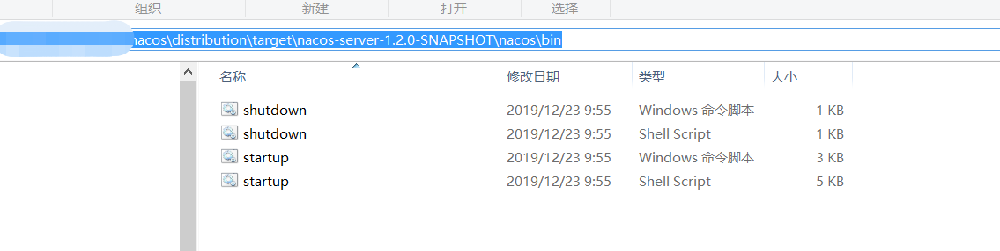
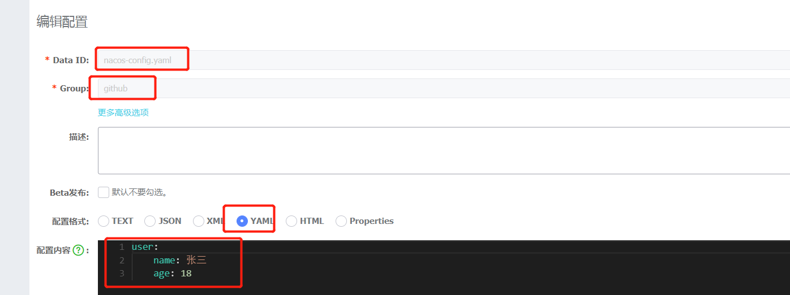
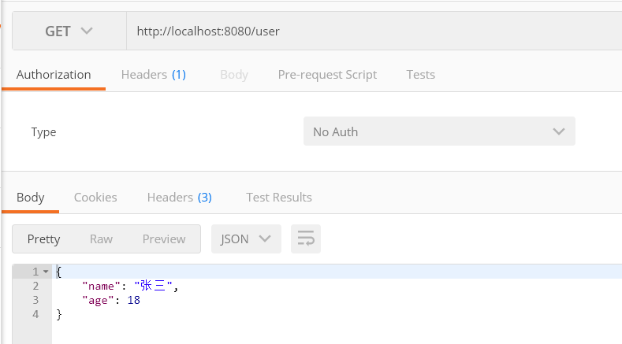
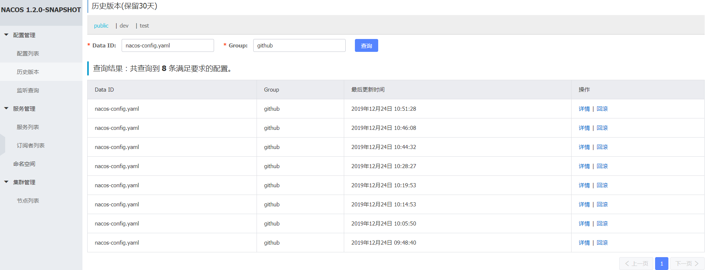
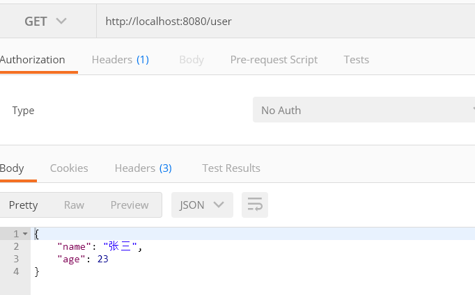
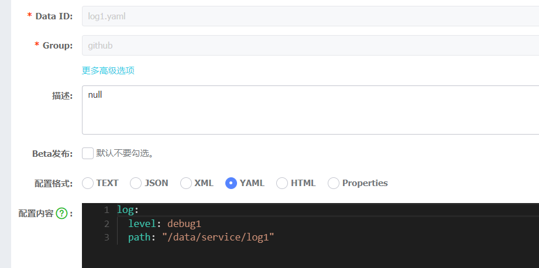
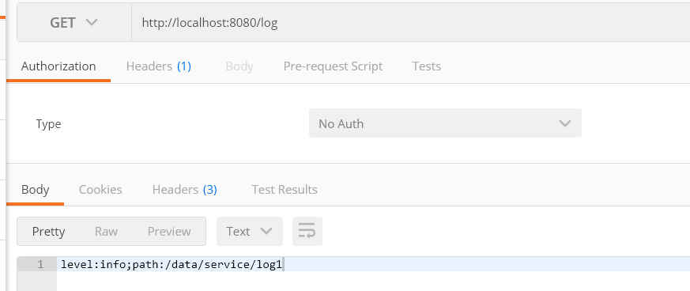
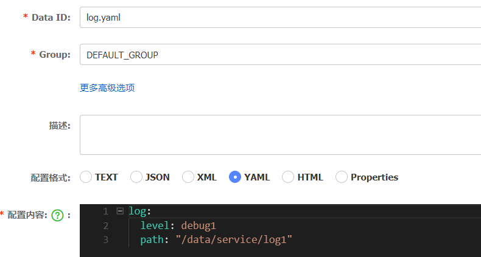

# Nacos基础spring cloud实现配置中心

## Nacos入门

新建spring boot项目，项目名称`nacos-config`，并添加一个`User`对象，包含`name`和`age`属性。

### 添加maven依赖
pom添加maven管理
```maven
<dependencyManagement>
    <dependencies>
        <dependency>
            <groupId>org.springframework.cloud</groupId>
            <artifactId>spring-cloud-alibaba-dependencies</artifactId>
            <version>0.2.1.RELEASE</version>
            <type>pom</type>
            <scope>import</scope>
        </dependency>
    </dependencies>
</dependencyManagement>
```
然后添加`nacos-config`maven依赖。
```maven
<dependency>
    <groupId>org.springframework.cloud</groupId>
    <artifactId>spring-cloud-starter-alibaba-nacos-config</artifactId>
</dependency>
```

或者直接添加`nacos-config`依赖
```maven
<dependency>
    <groupId>org.springframework.cloud</groupId>
    <artifactId>spring-cloud-starter-alibaba-nacos-config</artifactId>
    <version>0.2.1.RELEASE</version>
</dependency>
```
### 维护配置信息

在nacos管理界面中添加如下配置：


### 配置相关信息

***注意***：配置文件应为：`bootstrap`,而不能为`application`。因为spring boot(spring cloud)首先加载的配置文件为`bootstrap`。

```yaml
spring:
  cloud:
    nacos:
      config:
        server-addr: 127.0.0.1:8848
        file-extension: your configuration format
        group: yourgourpname
        prefix: yourdataidname #此处名称应与在nacos创建的配置文件名称一致，如不维护默认取项目名称
```
### 新建配置信息

在`Nacos`管理界面中打开`配置列表`，新建一个配置文件。

***注意***：
+ Nacos暂只支持`yaml`和`properties`格式。
+ Data ID为配置文件名，group为配置文件组。


### 读取配置文件

新建`UserController`，通过`@Value`注解获取配置信息。

**注意** 通过`@NacosPropertySource`和`@NacosValue`也可实现获取配置信息，如果采用了`Spring Cloud`，为了与其他配置中心兼容，推荐采用`@Value`注解。

```java
    @Value("${user.name}")
    private String name;

    @Value("${user.age}")
    private Integer age;

    @GetMapping("user")
    public User getUser(){
        User user = new User();
        user.setName(name);
        user.setAge(age);
        return user;
    }
```
通过api查询配置结果:



## Nacos基本概念

### 命名空间、分组、dataid

在`nacos-config`中有三个非常重要的概念：namespace、group及dataid。
[](../../img/nacos-config-manage.jpg)

+ dataid：配置文件名称，同一`group`下必须唯一。匹配规则为：`${spring.cloud.nacos.config.prefix}-${spring.profile.active}.${spring.cloud.nacos.config.file-extension}`

+ group: 配置组，不同`group`中可包含相同名称的`dataid`使用上比较灵活，可以按系统分组，也可按配置类型分组。

+ namespace：命名空间，具有数据隔离性，可以按不同租户进行隔离；也可按不同环境进行隔离，如：开发环境、测试环境、生产环境。


### 版本管理

打开`Nacos`管理界面`历史版本`菜单：输入`dataid`和`group`信息后可搜索最近30天更改记录。也可对指定配置信息进行回滚操作。



## 配置管理

### 配置动态刷新

在需要动态刷新的类上加上注解`@RefreshScope`。
此处注意，要保证`spring boot`版本与`spring cloud`版本想匹配；`spring cloud alibaba`版本与`spring boot`版本匹配。否则可能无法动态刷新配置内容。

| ***tips***：如果未动态刷新配置内容，可引入`spring boot`版本对应的`spring cloud`版本。


然后在`Nacos`管理界面更改配置内容后并发布。
```yaml
user:
    name: 张三
    age: 23
```

此时可重新调用api获取`user`信息：



### 多文件加载配置

在项目实施微服务化后，我们可能需要不同服务的配置内容抽离出公共部分，实现统一管理。

我们在`Nacos`管理界面增加一个日志配置文件。


修改`bootstrap.yml`配置内容：
```yml
spring:
  application:
    name: nacos-config
  cloud:
    nacos:
      config:
        server-addr: 127.0.0.1:8848
        prefix: nacos-config
        file-extension: yaml
        group: github

        ext-config[0].dataId: log1.yaml
        ext-config[0].group: github
        ext-config[0].refresh: true
```
添加`LogController`
```java
@RestController
@RefreshScope
public class LogController {

    @Value("${log.level}")
    private String logLevel;

    @Value("${log.path}")
    private String logPath;

    @GetMapping("log")
    public String getLogLevel(){
        return "level:"+ logLevel+";path:"+logPath;
    }
}
```
浏览结果:


### 共享配置文件

下面以`shared-dataids`实现配置共享配置文件。

1、将`ext-config`配置方式注释。添加`shared-dataids`和
`refreshable-dataids`。
```yml
    nacos:
      config:
        server-addr: 127.0.0.1:8848
        prefix: nacos-config
        file-extension: yaml
        group: github
        shared-dataids: log.yaml
        refreshable-dataids: log.yaml

#        ext-config[0].dataId: log1.yaml
#        ext-config[0].group: github
#        ext-config[0].refresh: true
```

2、新建log.yml，配置文件，注意`gourp`为默认值。



再次调用api查看结果，发现结果一致。

## 总结

+ nacos config读取配置主要有以下三种方式：

A：通过`spring.cloud.nacos.config.shared-dataids`方式；

B：通过`spring.cloud.nacos.config.ext-config`方式

C：通过`spring.cloud.nacos.config.prefix`方式

如果同时采用多个方式获取配置内容，配置文件包含相同key的话，优先级为：C->B->A。


## 参考

[Nacos博客](https://nacos.io/zh-cn/blog/index.html)

